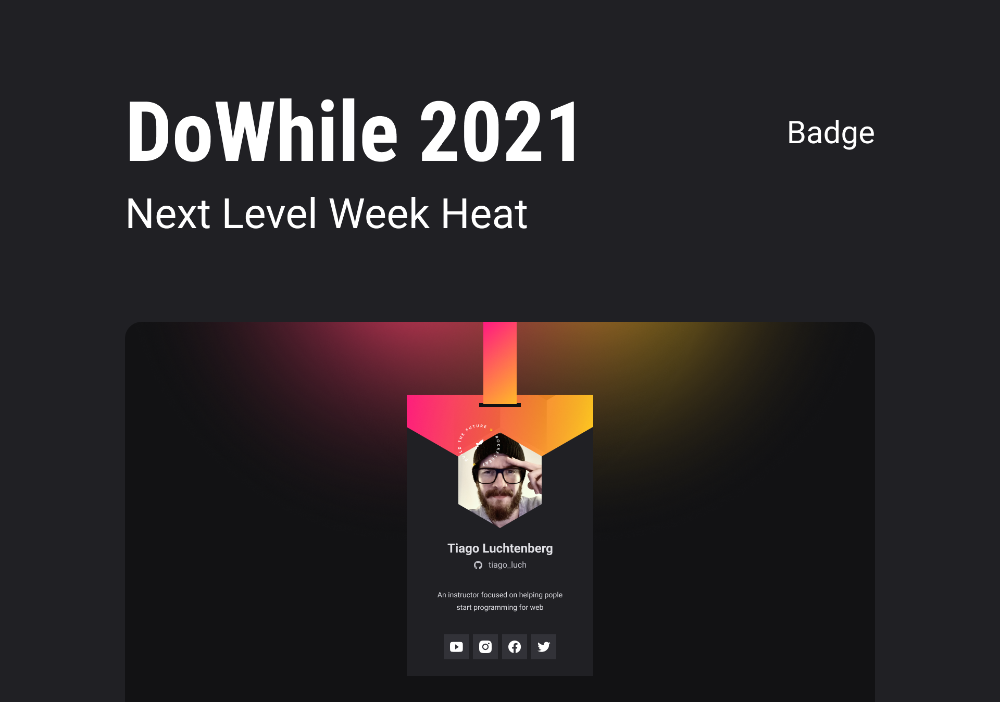

# Next Level Week | Heat

> Responsive card that adapts to desktop and mobile, absolute and relative measures were used. Taught at Next Level Week | Heat by Rocketseat. It was passed as a challenge to make the desktop version, so I did and ended up refactoring the code.

